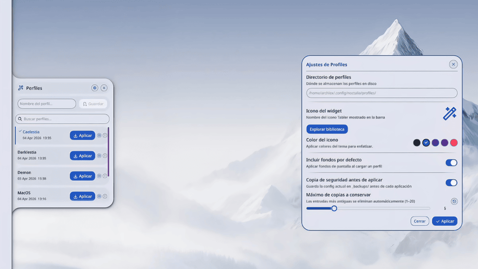
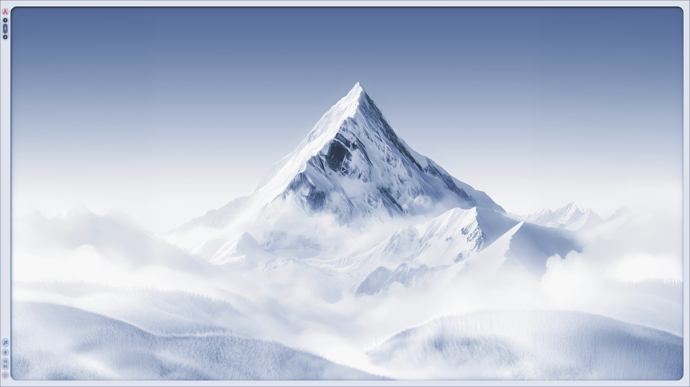
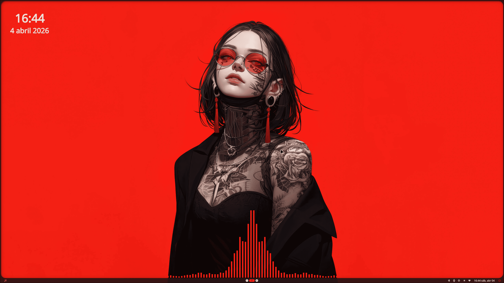
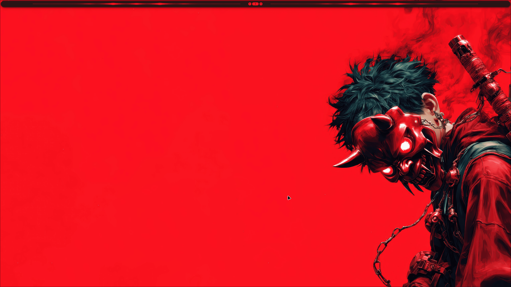
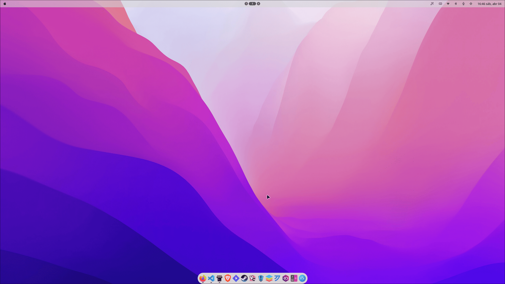

# 🗂️ Profile manager for Noctalia

[](https://opensource.org/licenses/MIT)
[](https://github.com/noctalia-dev/noctalia-shell)


A powerful plugin to save, load, and manage your entire desktop configuration snapshots. 
Switch between setups, colors, and wallpapers in a single click.

## 📷 Widget Preview




## ✨ Features

- **Save profiles** — Snapshot `settings.json`, `colors.json`, `plugins.json`, and wallpapers.
- **Apply profiles** — Restore a full configuration instantly.
- **Active indicator** — Visual feedback (accent bar + check icon) for the current profile.
- **Auto-backup** — Safety first! Current config is backed up before applying new ones.
- **Search** — Real-time filtering by profile name.
- **IPC Support** — Fully scriptable via `qs ipc`.
- **i18n** — Support for 12 languages out of the box.

---

## 🎨 Assets

> [!NOTE]
To keep the plugin repository lightweight, the themes shown in the screenshots and GIF are available at the link below. They include high-resolution wallpapers and full configurations.

[👉 Download Themes here](https://github.com/Archlexx/noctalia-profile-manager)

| **Caelestia** | **Darklestia** | **Demon** |
| :---: | :---: | :---: |
|  |  |  |
| **MacOS** | **MacOS Dark** | **Windows 26** |
|  |  |  |

---

## 🛠️ Installation

1. Go to plugins in your noctalia settings, and download it.
2. Enable the plugin.

---

## ⚙️ Settings

| Setting | Default | Description |
|---|---|---|
| `profilesDir` | `~/.config/noctalia/profiles/` | Directory where profiles are stored |
| `icon` | `bookmark` | Tabler icon shown in the bar widget |
| `iconColor` | `primary` | Accent color for the bar icon (`primary`, `secondary`, `tertiary`, `error`) |
| `includeWallpapers` | `true` | Whether new profile rows default to applying wallpapers |
| `backupEnabled` | `true` | Create an auto-backup before each profile apply |
| `backupCount` | `5` | Maximum number of backups to keep (1–20) |

---

## Profile structure

```
~/.config/noctalia/profiles/
├── my-profile/
│   ├── settings.json
│   ├── colors.json
│   ├── plugins.json
│   ├── wallpapers.json
│   └── meta.json          ← { "savedAt": "2026-04-03T00:35:00.000Z" }
└── _backups/
    └── 2026-04-03_00-35-00/
        ├── settings.json
        ├── colors.json
        ├── plugins.json
        ├── wallpapers.json
        └── meta.json
```

Profiles whose folder name starts with `_` or `.` are hidden from the list.

---

## ⌨️ IPC

Send commands to the plugin from a script or keybind:

```bash
# Toggle the profiles panel
qs ipc call plugin:shell-profiles toggleProfiles

# Apply a profile by name (uses the default includeWallpapers setting)
qs ipc call plugin:shell-profiles applyProfile 'my-profile'
```

### Binding IPC to keybinds by compositor

#### Hyprland (`~/.config/hypr/hyprland.conf`)

```ini
bind = SUPER, P, exec, qs -c noctalia-shell ipc call plugin:shell-profiles toggleProfiles
bind = SUPER SHIFT, F1, exec, qs -c noctalia-shell ipc call plugin:shell-profiles applyProfile 'Darklestia'
```

#### Niri (`~/.config/niri/config.kdl`)

```kdl
binds {
    Mod+Shift+P { spawn "sh" "-c" "qs ipc call plugin:shell-profiles toggleProfiles"; }
    Mod+Shift+F1 { spawn "sh" "-c" "qs ipc call plugin:shell-profiles applyProfile 'my-profile'"; }
}
```

#### Sway (`~/.config/sway/config`)

```
bindsym $mod+Shift+p exec qs ipc call plugin:shell-profiles toggleProfiles
bindsym $mod+Shift+F1 exec qs ipc call plugin:shell-profiles applyProfile 'my-profile'
```

#### labwc (`~/.config/labwc/rc.xml`)

```xml
<keybind key="W-S-p">
  <action name="Execute">
    <command>qs ipc call plugin:shell-profiles toggleProfiles</command>
  </action>
</keybind>
<keybind key="W-S-F1">
  <action name="Execute">
    <command>qs ipc call plugin:shell-profiles applyProfile 'my-profile'</command>
  </action>
</keybind>
```

---

## 🌍 Languages

| Code | Language |
|------|----------|
| `en` | English |
| `es` | Spanish |
| `de` | German |
| `fr` | French |
| `it` | Italian |
| `pt` | Portuguese |
| `nl` | Dutch |
| `ru` | Russian |
| `ja` | Japanese |
| `zh-CN` | Chinese (Simplified) |
| `tr` | Turkish |
| `uk-UA` | Ukrainian |

---
## 📜 License

This project is licensed under the MIT License.
